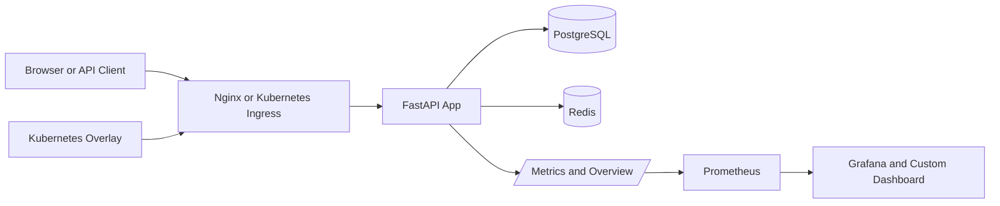

# Smart Auth API

Smart Auth API is a beginner-friendly but resume-grade backend project built with FastAPI, PostgreSQL, Redis, JWT, OAuth, Docker, and Nginx. It demonstrates the kind of architecture employers expect in 2026 for a modern backend service: typed API contracts, token-based authentication, OAuth login with Google and GitHub, database migrations, rate limiting, Dockerized local development, and clear deployment guidance.

It now also includes structured JSON logging, Prometheus metrics, a Grafana API dashboard, and Kubernetes manifests so the project looks much closer to a modern production backend.

It also includes GitHub Actions workflows for CI and Docker image publishing so the repository can automatically test the app and publish a container image to GitHub Container Registry.

The internal code structure is also organized to stay scalable: API routes stay thin, business rules live in services, and database access is moving through repository-style classes so features can be changed without rewriting the whole app.

## Small Architecture Diagram



Plain English:

- the client talks to one public entry point
- that entry point sends traffic to FastAPI
- FastAPI stores long-term data in PostgreSQL
- FastAPI stores fast temporary security data in Redis
- Prometheus and the dashboard help you see what the backend is doing while it is running

## Start The Project

This is the fastest way to run the project locally.

### Prerequisites

- Docker Desktop installed and running
- Python already installed on your machine if you want to run commands like tests or Alembic locally
- A `.env` file created from `.env.example`

### 1. Create the environment file

PowerShell:

```powershell
.\scripts\bootstrap-local-env.ps1
```

This generates a local `.env` with a strong `SECRET_KEY`, a non-default PostgreSQL password,
and a non-default Grafana admin password. Add your OAuth client credentials afterward if you
want Google or GitHub login to work locally.

### 2. Start all services

```powershell
docker compose up --build
```

This starts:

- `api`: the FastAPI backend
- `db`: PostgreSQL database
- `redis`: Redis for rate limiting and temporary auth data
- `nginx`: reverse proxy in front of the API
- `prometheus`: metrics collection service
- `grafana`: dashboard for API traffic and latency

### 3. Run the database migration

Open a second terminal in the project folder and run:

```powershell
docker compose exec api alembic upgrade head
```

This creates the tables for users, OAuth accounts, and refresh tokens.

### 4. Open the running app

- Main URL through Nginx: http://localhost
- Direct API dashboard: http://localhost:8000
- Swagger docs: http://localhost/docs
- Health check: http://localhost/api/v1/health
- Metrics endpoint: http://localhost/metrics
- Prometheus UI: http://localhost:19090
- Grafana UI: http://localhost:13000

Note:

- On the first Docker build, the API container may take a short time to finish installing dependencies and starting up.
- During that short window, Nginx can return a temporary `502 Bad Gateway`. Refresh after a few seconds.
- Grafana login now uses the generated values from `.env` instead of a shared default admin password.
- Prometheus and Grafana host ports are configurable through `PROMETHEUS_PORT` and `GRAFANA_PORT` if those defaults are already in use on your machine.

## Troubleshooting

| Symptom                                                                         | Likely cause                                                                                  | What to do                                                                                                                                            |
| ------------------------------------------------------------------------------- | --------------------------------------------------------------------------------------------- | ----------------------------------------------------------------------------------------------------------------------------------------------------- |
| `502 Bad Gateway` on `http://localhost` right after `docker compose up --build` | Nginx started before the API finished booting                                                 | Wait a few seconds, then refresh. Confirm with `docker compose ps` that `api` is healthy.                                                             |
| `api` container keeps restarting                                                | Missing or invalid values in `.env`                                                           | Re-run `./scripts/bootstrap-local-env.ps1`, then compare your `.env` against `.env.example`.                                                          |
| `PUBLIC_BACKEND_URL must use HTTPS in production`                               | `APP_ENV=production` is set while using a local `http://` URL                                 | For local work, use `APP_ENV=development`. Reserve production mode for real HTTPS deployments.                                                        |
| OAuth login returns provider or callback errors                                 | Google or GitHub client ID/secret is missing or callback URL does not match provider settings | Update the OAuth values in `.env` and make sure the provider callback exactly matches the URL documented in the app config.                           |
| Rate limiting or OAuth state behaves strangely                                  | Redis is not running or not reachable from the API                                            | Check `docker compose ps`, then inspect Redis with `docker compose logs redis`.                                                                       |
| Login works but refresh/logout does not                                         | Database migrations were not applied                                                          | Run `docker compose exec api alembic upgrade head` and retry.                                                                                         |
| Prometheus or Grafana does not open                                             | Host port is already in use                                                                   | Change `PROMETHEUS_PORT` or `GRAFANA_PORT` in `.env`, then restart with `docker compose up -d --build`.                                               |
| Dashboard loads but looks empty                                                 | The overview endpoint is unavailable or the API is still starting                             | Open `http://localhost:8000/api/v1/system/overview` directly and confirm it returns JSON.                                                             |
| `configmap` or `secret` not found in Kubernetes                                 | Overlay-generated files were applied into the wrong namespace or not regenerated              | Re-run `./scripts/export-k8s-overlay-env.ps1 -Overlay local`, then apply the overlay again and confirm resources exist in the `smart-auth` namespace. |
| Kubernetes API pod never becomes ready                                          | Postgres, Redis, or config validation failed during startup                                   | Check `kubectl get pods -n smart-auth`, then `kubectl logs deployment/smart-auth-api -n smart-auth`.                                                  |

### Dashboard behavior

The root dashboard is now an operator screen, not a static landing page.

- It reads live backend state from `GET /api/v1/system/overview`.
- It shows request totals, error counts, latency, uptime, OAuth readiness, and route activity.
- Prometheus and Grafana links are driven by environment variables instead of hardcoded localhost values inside the frontend.

### 5. Test that the API works

You can now use Swagger UI or call endpoints like:

- `POST /api/v1/auth/register`
- `POST /api/v1/auth/login`
- `GET /api/v1/auth/me`

## Example API Flow

These examples are the easiest way to understand what the project actually does.

### 1. Register a user

Request:

```json
{
  "email": "demo@example.com",
  "full_name": "Demo User",
  "password": "StrongPass123"
}
```

Call:

- Method: `POST`
- URL: `http://localhost/api/v1/auth/register`

What it does:

- Creates the user in PostgreSQL
- Hashes the password before storing it
- Returns an access token and refresh token

### 2. Log in

Request:

```json
{
  "email": "demo@example.com",
  "password": "StrongPass123"
}
```

Call:

- Method: `POST`
- URL: `http://localhost/api/v1/auth/login`

What it does:

- Checks the email and password
- Creates a short-lived access token
- Creates a longer-lived refresh token

### 3. Call a protected route

Call:

- Method: `GET`
- URL: `http://localhost/api/v1/auth/me`
- Header: `Authorization: Bearer YOUR_ACCESS_TOKEN`

What it does:

- Verifies the JWT access token
- Reads the matching user from PostgreSQL
- Returns the logged-in user's profile

### 4. Refresh the access token

Request:

```json
{
  "refresh_token": "YOUR_REFRESH_TOKEN"
}
```

Call:

- Method: `POST`
- URL: `http://localhost/api/v1/auth/refresh`

What it does:

- Validates the refresh token
- Revokes the previous refresh token record
- Returns a new access token and a new refresh token

### 5. Log out

Request:

```json
{
  "refresh_token": "YOUR_REFRESH_TOKEN"
}
```

Call:

- Method: `POST`
- URL: `http://localhost/api/v1/auth/logout`

What it does:

- Marks the refresh token as revoked in PostgreSQL
- Prevents that refresh token from being reused later

### 6. Start Google or GitHub login

Call one of these:

- `GET http://localhost/api/v1/auth/oauth/google/login`
- `GET http://localhost/api/v1/auth/oauth/github/login`

What it does:

- Creates a secure temporary `state` value in Redis
- Returns a provider authorization URL
- Sends the user to Google or GitHub for login approval

### 7. OAuth callback

After the provider redirects back, the backend callback endpoint:

- validates the temporary `state` from Redis
- exchanges the provider code for user identity data
- creates or updates the local user
- returns JWT tokens for your API

## Start Without Docker

Use this only if you already have PostgreSQL and Redis running yourself.

```powershell
pip install -e .[dev]
alembic upgrade head
uvicorn app.main:app --reload
```

If you use this mode, make sure `.env` points to your own PostgreSQL and Redis instances.

## Why This Project Is Strong For A Resume

- Uses a real backend stack instead of a tutorial-only toy app.
- Shows both classic email/password auth and OAuth login.
- Uses PostgreSQL for durable data and Redis for API protection.
- Includes JWT access and refresh token flow with rotation.
- Ships with Docker Compose and Nginx for realistic local deployment.
- Keeps the code intentionally readable so you can explain it in interviews.

## Tech Stack

- FastAPI for the API layer
- PostgreSQL for users, OAuth links, and refresh tokens
- Redis for rate limiting and OAuth state storage
- Nginx as a reverse proxy
- JWT for access and refresh tokens
- Google and GitHub OAuth login support
- SQLAlchemy and Alembic for data models and migrations
- Structlog and JSON logs for modern backend logging
- Prometheus for API metrics
- Grafana for dashboards
- Kubernetes manifests for container orchestration

## Why These Pieces Exist

This section explains the major tools in plain English: what problem each one solves here, and what would happen if you removed it.

### Docker

Docker makes the app, PostgreSQL, Redis, Nginx, Prometheus, and Grafana run in predictable containers instead of depending on whatever happens to be installed on your machine.

Example:

- without Docker, one machine might use PostgreSQL 16, another might use PostgreSQL 14, and another might not have Redis installed at all
- with Docker, everyone runs the same services the same way

If you do not use Docker here:

- setup becomes slower and more fragile
- "it works on my machine" problems become much more common
- onboarding and demo setup become harder

### Kubernetes

Kubernetes solves the next problem after Docker: running containers reliably in a cluster instead of just on one local machine.

Example:

- Docker says, "run this API container"
- Kubernetes says, "keep one or more API containers alive, restart them if they die, wait for Postgres to be ready, expose the service, and keep configuration separate from the image"

If you do not use Kubernetes here:

- the project still works locally with Docker Compose
- but you do not show cluster deployment skills like health probes, rolling updates, service discovery, and ingress routing

### PostgreSQL

PostgreSQL stores data that must survive restarts: users, OAuth links, and refresh tokens.

Example:

- if a user signs up today, that account still needs to exist tomorrow

If you do not use a real database here:

- accounts disappear when the app restarts
- refresh token revocation becomes unreliable
- the project stops looking like a serious backend

### Redis

Redis stores fast temporary data. In this project it is used for rate limiting and short-lived OAuth state.

Example:

- when a user keeps hitting login over and over, Redis can quickly count those attempts and slow them down
- when OAuth starts, Redis stores a short-lived `state` value to protect the callback flow

If you do not use Redis here:

- rate limiting becomes much harder or slower
- OAuth state handling becomes weaker
- you would probably push temporary security data into PostgreSQL even though it is not the best fit

### JWT access tokens and refresh tokens

JWT access tokens let the API verify who the user is on each request without storing a server-side session for every logged-in user. Refresh tokens let users stay logged in without making access tokens long-lived.

Example:

- the access token might live for 15 minutes
- the refresh token can be exchanged for a new access token later

If you do not use this pattern here:

- either users log in too often
- or you keep long-lived access tokens, which is worse for security
- or you move back to server-side sessions, which changes the architecture completely

### Nginx

Nginx is the reverse proxy in front of the API for the Docker setup.

Example:

- the browser talks to Nginx on port 80
- Nginx forwards the request to the FastAPI app on port 8000

Why that matters:

- this is closer to how real deployments are usually structured
- it gives you one clean public entry point

If you do not use Nginx here:

- the project still works
- but you lose the reverse-proxy layer that many production systems rely on for routing and traffic control

### Alembic migrations

Alembic keeps database schema changes versioned.

Example:

- instead of manually creating tables every time, you run one command and the schema moves to the right version

If you do not use migrations here:

- database setup becomes manual
- changes become harder to track
- deployments become riskier because schema drift is easier to introduce

### Prometheus and the dashboard

Prometheus collects metrics. The custom dashboard and Grafana turn those metrics and service state into something readable.

Example:

- instead of only knowing "the server is up," you can also see request volume, latency, exceptions, OAuth readiness, and hot routes

If you do not use them here:

- debugging becomes slower
- performance problems stay hidden longer
- the project feels more like a coding exercise than an operational backend

## Stack In One Picture

You can think of the project like this:

- FastAPI handles the API logic
- PostgreSQL keeps durable identity data
- Redis handles fast temporary security data
- JWT handles stateless API authentication
- Docker makes local setup repeatable
- Kubernetes makes cluster deployment repeatable
- the dashboard makes runtime behavior visible

## Docker Check

I tested the project against Docker Compose on this machine.

What was true:

- Docker Compose was already installed and working.
- The project did not start automatically at first because `.env` was missing.
- After adding `.env`, the stack built correctly.
- The next runtime issue was a config parsing bug for `CORS_ORIGINS`, which has now been fixed.

What this means:

- Yes, the project is compatible with an existing Docker setup.
- The stack should work with your current Docker installation as long as Docker Desktop is running.
- Google and GitHub login still require real OAuth credentials before those specific endpoints can complete the external login flow.
- The observability stack also runs in Docker now, so Prometheus and Grafana should come up with the same `docker compose up --build` command.

## Docker Gotchas

- The first build can take a while because Python dependencies and images need to download.
- If `.env` changes database or Grafana credentials after volumes already exist, the running containers may need those credentials updated too. Changing `.env` alone is not always enough because the volume can preserve old state.
- A temporary `502 Bad Gateway` from Nginx usually means the API container is still starting.
- Prometheus and Grafana ports can conflict with tools already running on your machine, which is why they are configurable in `.env`.

## Architecture Summary

The project is organized around a few simple ideas:

- `app/api`: FastAPI routes and request dependencies
- `app/core`: settings, security, and rate limiting
- `app/middleware`: request logging, request IDs, and metrics collection
- `app/db`: database engine and metadata wiring
- `app/models`: SQLAlchemy models
- `app/repositories`: focused database access classes for users, refresh tokens, and OAuth links
- `app/schemas`: Pydantic request and response models
- `app/services`: business logic for auth and OAuth
- `alembic`: database migrations
- `nginx`: reverse proxy configuration
- `prometheus`: scrape configuration for metrics collection
- `grafana`: dashboard provisioning and API monitoring panels
- `k8s`: Kubernetes manifests for container deployment

## Authentication Flow

### Email and password

1. A user registers with email, full name, and password.
2. The password is hashed with Argon2 via `pwdlib`.
3. The API returns an access token and a refresh token.
4. Refresh tokens are stored in PostgreSQL so they can be rotated and revoked.

### Google and GitHub login

1. The client requests `/api/v1/auth/oauth/{provider}/login`.
2. The API generates a provider URL and stores a secure `state` value in Redis.
3. The provider redirects back to `/api/v1/auth/oauth/{provider}/callback`.
4. The backend exchanges the code for provider user info, creates or updates the local user, and issues JWT tokens.

### Rate limiting

- Auth endpoints are protected with Redis-backed per-IP rate limiting.
- If Redis is temporarily unavailable, rate limiting fails open so the API still works during local development.

## Important Environment Variables

- `SECRET_KEY`: signs JWT tokens, so it must be long and secret in production
- `LOG_LEVEL`: controls how detailed the backend logs should be
- `DATABASE_URL`: tells the API how to connect to PostgreSQL
- `REDIS_URL`: tells the API how to connect to Redis
- `PUBLIC_BACKEND_URL`: used to build OAuth callback URLs
- `CORS_ORIGINS`: controls which frontend origins are allowed to call the API from a browser
- `GRAFANA_ADMIN_USER` and `GRAFANA_ADMIN_PASSWORD`: control local Grafana login credentials
- `GOOGLE_CLIENT_ID` and `GOOGLE_CLIENT_SECRET`: enable Google login
- `GITHUB_CLIENT_ID` and `GITHUB_CLIENT_SECRET`: enable GitHub login

## Monitoring And Dashboard

### What is already included

- `/metrics` exposes Prometheus metrics from the FastAPI app
- Prometheus scrapes the API automatically
- Grafana auto-loads a dashboard called `Smart Auth API Observability`

### What the dashboard shows

- request rate
- unhandled exceptions
- p95 response time by route
- request breakdown by method, route, and status code

### Why this matters

These tools make the project feel more like a real production backend. Instead of only seeing whether the API is up, you can see how busy it is, which routes are slow, and whether errors are increasing.

### What problem the custom dashboard solves

Swagger tells you how to call the API. The dashboard tells you what the backend is doing right now.

Example:

- Swagger helps you test `POST /login`
- the dashboard helps you notice that login traffic is spiking or that the API has started throwing errors

If you remove the dashboard:

- the backend still works
- but it becomes harder to understand its live behavior at a glance

## GitHub Actions

The repository includes two GitHub Actions workflows:

- `.github/workflows/ci.yml`
- `.github/workflows/publish-image.yml`

### What it does

- runs tests on Python 3.12 and 3.14
- installs the project with development dependencies
- builds the Docker image to catch container-level breakage early
- publishes a Docker image to GitHub Container Registry on pushes to `main` or `master` and on version tags like `v1.0.0`

### Why this matters

This makes the project look more production-ready on GitHub. It also helps prevent broken commits from being merged without at least basic validation.

### Published image format

The publish workflow pushes images in this shape:

- `ghcr.io/YOUR_GITHUB_USERNAME/smart-auth-api:latest`
- `ghcr.io/YOUR_GITHUB_USERNAME/smart-auth-api:sha-...`
- `ghcr.io/YOUR_GITHUB_USERNAME/smart-auth-api:v1.0.0`

If you want Kubernetes to use the published image, point the production overlay at your real GHCR image before applying it.

## Kubernetes

The Kubernetes setup now uses a real Kustomize structure instead of isolated YAML files.

### What Kubernetes is solving here

Docker is enough to run everything on one machine. Kubernetes is used when you want the platform to manage the containers for you.

In this project, Kubernetes handles:

- keeping the API running
- starting Postgres and Redis as in-cluster services
- creating persistent storage
- separating config and secrets from the image
- exposing the API through an ingress
- running the migration job in the cluster

### Folder layout

- `k8s/base`: reusable resources shared by every environment
- `k8s/overlays/local`: local cluster settings for Minikube, kind, or Docker Desktop Kubernetes
- `k8s/overlays/production`: production-specific settings
- `scripts/export-k8s-overlay-env.ps1`: generates overlay config from your current `.env`

### Local Kubernetes setup

If you want to run this project on Minikube locally:

1. Start Minikube.
2. Build the local image.
3. Load the image into Minikube.
4. Export the local overlay env files.
5. Apply the local overlay.

Commands:

```powershell
minikube start --driver=docker
docker build -t smart-auth-api:latest .
minikube image load smart-auth-api:latest
.\scripts\export-k8s-overlay-env.ps1 -Overlay local
kubectl apply -k k8s/overlays/local
```

### Local Kubernetes gotchas

- The local overlay intentionally uses `APP_ENV=development`. This is not a mistake. It is needed because the production validator requires an `https://` public URL, while local Minikube usually uses `http://` during development.
- Generated `ConfigMap` and `Secret` resources must be in the same namespace as the workloads. If they land in `default`, the pods will fail with `configmap not found` or `secret not found` errors.
- If you rebuild the app image, load it into Minikube again before restarting the deployment.
- If the migration job failed because of bad config, deleting the old job and re-applying the overlay is the cleanest fix.
- Ingress on Minikube usually needs the ingress addon enabled. In many setups you also need `minikube tunnel` before the host becomes reachable from your browser.
- If ingress is not ready yet, `kubectl port-forward svc/smart-auth-api 8080:80 -n smart-auth` is the fastest fallback.

### Production Kubernetes flow

1. Copy `k8s/overlays/production/config.env.example` to `k8s/overlays/production/config.env`.
2. Copy `k8s/overlays/production/secrets.env.example` to `k8s/overlays/production/secrets.env`.
3. Set your real image, real domain, and real secrets.
4. Apply with `kubectl apply -k k8s/overlays/production`.

### Why the Kubernetes setup is useful now

- it was validated on Minikube, not just written as placeholder YAML
- the local overlay can actually boot the app, run the migration, and expose the service
- it documents the real failure modes we hit while making it work

Detailed Kubernetes commands and cluster notes are in `k8s/README.md`.

## Architecture Choices

### Repository layer

The repository layer keeps SQL queries out of the API routes and reduces duplication inside services. This matters because when the project grows, database logic can change in one place instead of being scattered across many files.

### Thin routes and service layer

The API routes mostly validate input and call services. The services hold the real auth logic. This makes the code easier to test, easier to extend, and easier to replace later if you add more auth methods or admin workflows.

### Provider-based OAuth structure

The OAuth code is organized so each provider can have its own fetch logic and config. That makes it much easier to add another login provider later, such as Microsoft or Discord, without rewriting the whole OAuth flow.

## OAuth Setup

### Google OAuth

Create credentials in Google Cloud Console and add this callback URL:

```text
http://localhost/api/v1/auth/oauth/google/callback
```

### GitHub OAuth

Create an OAuth app in GitHub Developer Settings and add this callback URL:

```text
http://localhost/api/v1/auth/oauth/github/callback
```

## Core Endpoints

- `POST /api/v1/auth/register`
- `POST /api/v1/auth/login`
- `POST /api/v1/auth/refresh`
- `POST /api/v1/auth/logout`
- `GET /api/v1/auth/me`
- `GET /api/v1/auth/oauth/google/login`
- `GET /api/v1/auth/oauth/google/callback`
- `GET /api/v1/auth/oauth/github/login`
- `GET /api/v1/auth/oauth/github/callback`
- `GET /api/v1/health`

## Free Hosting Strategy For 2026

For a real public deployment, use this split:

- FastAPI app: Render, Railway, or Fly.io
- PostgreSQL: Neon or Supabase Postgres free tier
- Redis: Upstash free tier
- Nginx: optional in production if the platform already handles ingress

This keeps your GitHub repo professional while still being affordable.

## Deployment Idea

For a clean real deployment, use this pattern:

1. Push the code to GitHub.
2. Deploy the FastAPI app to Render, Railway, or Fly.io.
3. Use Neon or Supabase for PostgreSQL.
4. Use Upstash for Redis.
5. Add the hosted environment variables in the deployment platform.
6. Update `PUBLIC_BACKEND_URL` to your real domain.

## Suggested GitHub Repo Talking Points

Use these ideas in your README summary, LinkedIn post, or interview explanation:

- Built a production-style authentication API using FastAPI, PostgreSQL, Redis, JWT, and OAuth.
- Implemented refresh token rotation and revocation.
- Protected sensitive endpoints with Redis-backed rate limiting.
- Dockerized the stack with Nginx reverse proxy for realistic local deployment.
- Designed the codebase with modular services, schemas, and migration support.
- Structured the backend with thin routes, service logic, and repository-style data access for easier long-term maintenance.
- Added structured JSON logging, Prometheus metrics, and a Grafana dashboard for API observability.
- Added Kubernetes manifests for container-based deployment.
- Added GitHub Actions CI to automatically run tests and validate Docker builds.
- Added GitHub Actions publishing to push Docker images to GitHub Container Registry.

## Future Improvements

- Add email verification so users must prove they own the email address.
- Add password reset flow so forgotten passwords can be changed securely.
- Add role-based authorization so some routes can be limited to admins.
- Add account lockout or smarter anti-bruteforce rules for repeated failed logins.
- Add audit logs to track sensitive actions like login, logout, and token refresh.
- Add integration tests that run against a temporary PostgreSQL and Redis stack.
- Add OpenTelemetry tracing and Tempo or Jaeger for distributed tracing.
- Add Loki or another centralized log store so Grafana can explore logs too.
- Add email provider support for system emails such as verification and password reset.
- Add user profile update endpoints and account deletion flow.
- Add frontend client example in React or Next.js to demonstrate end-to-end login.

## Docker Cleanup

If you build often, Docker can keep old unused image layers and cache around.

Useful cleanup commands:

```powershell
docker image prune -f
docker builder prune -f
```

There is also an automated cleanup script in `scripts/cleanup-docker.ps1`.

### Safe cleanup

```powershell
.\scripts\cleanup-docker.ps1
```

This removes:

- stopped containers
- dangling images
- unused volumes
- old build cache

### More aggressive cleanup

```powershell
.\scripts\cleanup-docker.ps1 -Aggressive -IncludeNetworks
```

This also removes:

- all unused images, not just dangling ones
- unused Docker networks

What they do:

- `docker image prune -f` removes dangling unused images
- `docker builder prune -f` removes old build cache layers
- `docker volume prune -f` removes volumes not used by any container
- `docker container prune -f` removes stopped containers

The cleanup script is safe by default because it does not stop running containers or remove volumes attached to active containers.
